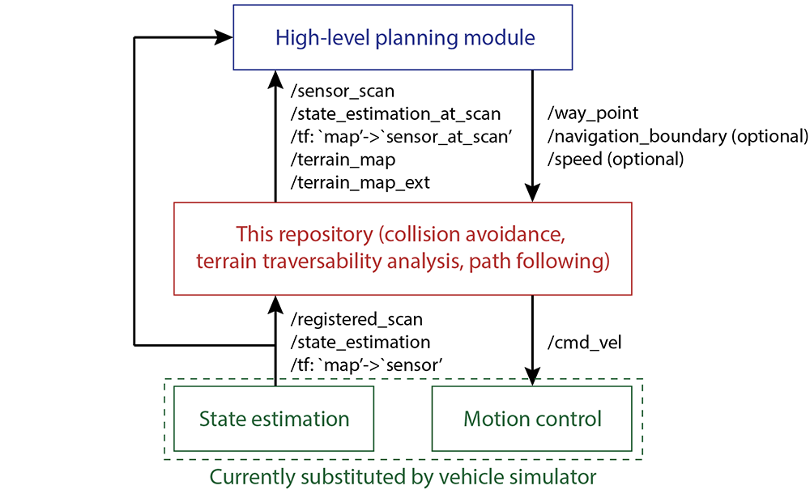

The repository is meant for leveraging system development and robot deployment for ground-based autonomous navigation and exploration. Containing a variety of simulation environments, autonomous navigation modules such as collision avoidance, terrain traversability analysis, waypoint following, etc, and a set of visualization tools, users can develop autonomous navigation systems and later on port those systems onto real robots for deployment.

Please use instructions on our [project page](https://www.cmu-exploration.com).

--------------------------
# Above is the original README.md of the repository. Below is my own README.md.


# This is a packages for autonomous exploration development environment
| Package Name | Description |
|--------------|-------------|
| joystick_drivers |  |
| loam_interface | interfaces between planing algorithm and state_estimation module (SLAM and relocalization) |
| local_planner | equavelent to controller in navigation2 stack. take waypoint generated by the planner as input and pub cmd_vel. Obstacle avoidance is implemented in this pack, somehow. |
| sensor_scan_generation | transforms the point to the map frame. |
| terrain_analysis |  analyzes the local smoothness of the terrain, i.e. process lidar data; used by the collision avoidance module; covers a 10m x 10m area with the vehicle in the center.  |
| terrain_analysis_ext |  extends the terrain map to a 40m x 40m area. The extended terrain map keeps lidar points over a sliding window of 10 seconds with a non-decay region within 4m from the vehicle.  |
| vehicle_simulator | description and controlment of the simulated vehicle. ignore it if you are working with a real robot. |
| velodyne_simulator | simulate lidar |
| visualization | visualize performance of the algorithm. display the pre-generated map in ply format on the rviz pannle. |
| waypoint_example | --- |
| waypoint_rviz_plugin | rviz plugin |


# How to Integrating System on Real Robot

this diagram shows the data flow of the system.


Only **/registed_scan, /state_estimation and /tf:'map'->'sensor'**(provided by your SLAM and relolization modulem or you can let your loam system pub the map-sensor transform directly. ) are required to run the system. The rest of the topics generated by the development system.

So we simply disable the fake tf msgs published by simulator and replace it with the real robot's tf msgs, as the development system is designed to be compatible with the real robot.

- change the frame name of your lidar and chassis to "sensor" and "vehicle"(usually "base_link" if you obey the ROS standard) respectively. Transformation between sensor and camera is not required if you are using lidar only.
- modify code of this package is not recommended, as it is more complecated.
- comment out the fake tf msgs published by simulator in the launch file(local_planner/launch/local_planner.launch).
```xml
<!-- <node pkg="tf2_ros" exec="static_transform_publisher" name="vehicleTransPublisher" args="-$(var sensorOffsetX) -$(var sensorOffsetY) 0 0 0 0 /sensor /vehicle"/> -->

<!-- <node pkg="tf2_ros" exec="static_transform_publisher" name="sensorTransPublisher" args="0 0 $(var cameraOffsetZ) -1.5707963 0 -1.5707963 /sensor /camera"/> -->
```
- modify the topic name of your loam module output in the launch file under loam_interface/launch.

- registered_scan stands for lidar message that are registered to a specific frame.

- If playing bagfiles with lidar and optionally IMU data instead of running on a real robot, make sure to set 'use_sim_time = true'. and play bagfiles with '--clock' flag 
```bash
rosbag play --clock filename.bag
```


## More about configuration

1.  **[3D env]** 
    - **if the simulation environment** contains 3D terrain, set 'adjustZ = true' and 'adjustIncl = true' in vehicle simulator to adjust robot elevation and inclination according to the terrain. Set 'terrainZ' to the terrain elevation at the start position. 
    - Turning on terrain analysis: The system uses registered scans for collision avoidance by default. If driving over 3D terrains, terrain analysis becomes necessary. 
    - set 'useTerrainAnalysis = true' and adjust 'obstacleHeightThre' in 'src/local_planner/launch/local_planner.launch'.
        - The terrain analysis publishes 'sensor_msgs::PointCloud2' typed terrain map messages on ROS topic '/terrain_map', with 'pcl::PointXYZI' typed points in the messages. the larger the i value, the further this point is from the computed ground. You can also check if the terrain map is correct by visualizing it in RVIZ.
        - Clicking the clear-terrain-map button on the controller reinitializes the terrain map. Alternatively, one can send a 'std_msgs::Float32' typed message on ROS topic '/map_clearing'. The number in the message indicates the radius of the area to be cleared. Note that terrain analysis does require scans to be well registered. If the state estimation on the robot is imprecise and scans are misregistered, terrain analysis will likely sacrifice.

2. **[crop off the floor and ceilling]** Adjust 'minRelZ' and 'maxRelZ' in 'src/local_planner/launch/local_planner.launch' to crop off the ground and ceiling in the registered scans. For example, The default sensor height is set at 0.75m above the ground in the vehicle simulator and the registered scans are cropped at the height of -0.5m and 0.25m w.r.t. the sensor.

3. **[customed obstacle]** Adding additional sensors: The system can take data from additional sensors for collision avoidance. The data can be sent in as 'sensor_msgs::PointCloud2' typed messages on ROS topic '/added_obstacles'. The points in the messages are in the 'map' frame.

4. **[Tuning path following]**  To change driving speed, adjust 'maxSpeed', 'autonomySpeed', and 'maxAccel' in 'src/local_planner/launch/local_planner.launch'. Other path following parameters such as 'maxYawRate', 'yawRateGain', and 'lookAheadDis' are in the same file. If setting 'twoWayDrive = false', the robot will only drive forward.

5. **[Changing robot size]** The system uses motion primitives generated by a MatLab script. To change the robot size, adjust 'searchRadius' in 'src/local_planner/paths/path_generator.m' and run the MatLab script. This will generate a set of path files in the same folder.

6. **[Robot motion model]** The system uses a differential motion model. Adapting to other motion models, e.g. a car-like motion model, needs more work.

Adding additional sensors: The system can take data from additional sensors for collision avoidance. The data can be sent in as 'sensor_msgs::PointCloud2' typed messages on ROS topic '/added_obstacles'. The points in the messages are in the 'map' frame.

Handling negative obstacles: While the best way to handle negative obstacles is mounting a sensor high up on the robot looking downward into the negative obstacles, a quick solution is turning on terrain analysis and setting 'noDataObstacle = true' in 'src/terrain_analysis/launch/terrain_analysis.launch'. Negative obstacles usually cause some areas to have no data. The system will consider these areas to be non-traversable.