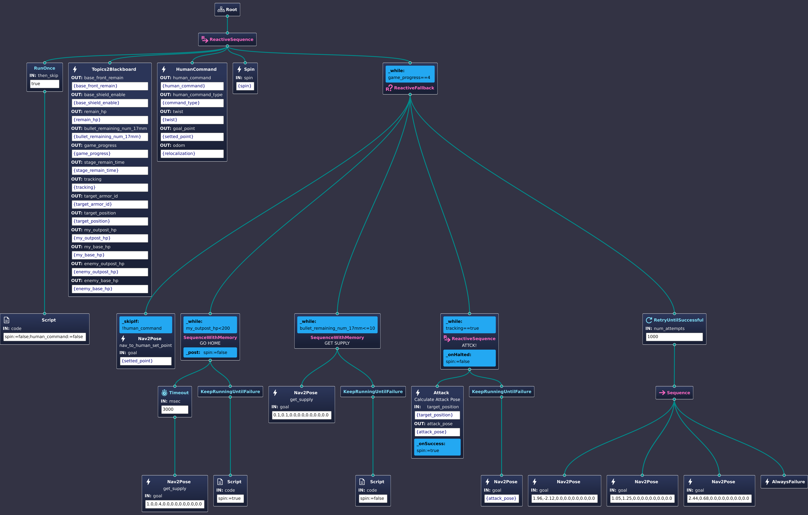

# rm_decision
a robot decision module base on BehaviorTree.CPP and ROS2

## 1. Install BehaviorTree.CPP

### 1.1 Install from source

### 1.2 Install Groot2

### NOTICE

- There are several differences between the official source and that in this repository. I modify the reactive_fallback.cpp(342ce3029e37c8836c0a53ca3e52a975de72cc79). See more details in the commit history.

- This documentation is a digest of the official documentation. For more details, please refer to the [official documentation](https://www.behaviortree.dev/).

- Server-client mode is recommended for the communication between the behavior tree and the robot control module. 

## 2. A INTRO 

### Basic Idea

Unlike a Finite State Machine, a behavior Tree is a tree of hierarchical nodes that controls the flow of execution of "tasks".

Everytime the tree is ticked, the tree will be traversed from the root node to the leaf node, and the leaf node will return a status code to the parent node, and the parent node will return a status code to the grandparent node, and so on, until the root node is reached. 

Though it is easy to understand, there are still some mistakes that are easy to make. And the only way to avoid these mistakes is to make mistakes and learn from them, at least for me.


## 3. Learning From a Detailed Example

### Tree Structure

The tree structure is defined in a xml file. A recommended way to create a tree is to use the Groot2, a graphical editor for BehaviorTree.CPP.



<details>
<summary>Tree Structure in xml file</summary>

```xml
<?xml version="1.0" encoding="UTF-8"?>
<root BTCPP_format="4">
  <BehaviorTree ID="RMUL">
    <ReactiveSequence>
      <RunOnce then_skip="true">
        <Script code="spin:=false;human_command:=false"/>
      </RunOnce>
      <Topics2Blackboard target_armor_id="{target_armor_id}"
                    tracking="{tracking}"
                    armor_id="{armor_id}"
                    target_position="{target_position}"
                    hurt_type=""
                    stage_remain_time="{stage_remain_time}"
                    game_progress="{game_progress}"
                    current_hp="{current_hp}"/>
      <HumanCommand human_command="{human_command}"
                    human_command_type="{command_type}"
                    twist="{twist}"
                    goal_point="{setted_point}"
                    odom="{relocalization}"/>
      <Spin spin="{spin}"/>
      <ReactiveFallback _while="game_progress==4">
        <Nav2Pose name="nav_to_human_set_point"
                  goal="{setted_point}"
                  _skipIf="!human_command"/>
        <SequenceWithMemory name="GO HOME"
                            _while="my_outpost_hp&lt;200"
                            _post="spin:=false">
          <Timeout msec="3000">
            <Nav2Pose name="get_supply"
                      goal="1.0,0.4,0.0,0.0,0.0,0.0,0.0"/>
          </Timeout>
          <KeepRunningUntilFailure>
            <Script code="spin:=true"/>
          </KeepRunningUntilFailure>
        </SequenceWithMemory>
        <SequenceWithMemory name="GET SUPPLY"
                            _while="bullet_remaining_num_17mm&lt;=10">
          <Nav2Pose name="get_supply"
                    goal="0.1,0.1,0.0,0.0,0.0,0.0,0.0"/>
          <KeepRunningUntilFailure>
            <Script code="spin:=false"/>
          </KeepRunningUntilFailure>
        </SequenceWithMemory>
        <ReactiveSequence name="ATTCK!"
                          _while="tracking==true"
                          _onHalted="spin:=false">
          <Attack name="Calculate Attack Pose"
                  target_position="{target_position}"
                  attack_pose="{attack_pose}"
                  _onSuccess="spin:=true"/>
          <KeepRunningUntilFailure>
            <Nav2Pose goal="{attack_pose}"/>
          </KeepRunningUntilFailure>
        </ReactiveSequence>
        <RetryUntilSuccessful num_attempts="1000">
          <Sequence>
            <Nav2Pose goal="1.96,-2.12,0.0,0.0,0.0,0.0,0.0"/>
            <Nav2Pose goal="1.05,1.25,0.0,0.0,0.0,0.0,0.0"/>
            <Nav2Pose goal="2.44,0.68,0.0,0.0,0.0,0.0,0.0"/>
            <AlwaysFailure/>
          </Sequence>
        </RetryUntilSuccessful>
      </ReactiveFallback>
    </ReactiveSequence>
  </BehaviorTree>

  <!-- Description of Node Models (used by Groot) -->
  <TreeNodesModel>
    <Action ID="Attack"
            editable="true">
      <input_port name="target_position"/>
      <output_port name="attack_pose"/>
    </Action>
    <Action ID="HumanCommand"
            editable="true">
      <output_port name="human_command"/>
      <output_port name="human_command_type"/>
      <output_port name="twist"/>
      <output_port name="goal_point"/>
      <output_port name="odom"/>
    </Action>
    <Action ID="Nav2Pose"
            editable="true">
      <input_port name="goal"/>
    </Action>
    <Action ID="Spin"
            editable="true">
      <input_port name="spin"/>
    </Action>
    <Action ID="Topics2Blackboard"
            editable="true">
      <output_port name="base_front_remain"/>
      <output_port name="base_shield_enable"/>
      <output_port name="current_hp"/>
      <output_port name="bullet_remaining_num_17mm"/>
      <output_port name="game_progress"/>
      <output_port name="stage_remain_time"/>
      <output_port name="tracking"/>
      <output_port name="target_armor_id"/>
      <output_port name="target_position"/>
      <output_port name="my_outpost_hp"/>
      <output_port name="my_base_hp"/>
      <output_port name="enemy_outpost_hp"/>
      <output_port name="enemy_base_hp"/>
    </Action>
  </TreeNodesModel>

</root>

```
</details>

It is east to grasp the intention of the tree. But it readlly take some time to make it right.

### Control Node

Control node manage the logic of the tree. There are three basic types of control node: sequence, fallback(selector), and parallel. Derived from these basic types, there are several other types of control node, such as reactive sequence, reactive fallback, and so on.

The best way to understand them is too see what the node will do when the child node returns RUNNING or FAILURE, and also see what scenario a spcific type of control node should be used.

| Type of ControlNode | Child returns RUNNING | Child returns FAILURE | 
|---|---|---|
| Fallback | Tick again | Tick next |
| ReactiveFallback	| Restart | Tick next |
| Sequence | Tick again | Restart |
| ReactiveSequence | Restart | Restart |
| SequenceWithMemory | Tick again | Tick again |


### Action Node

Create custom nodes with inheritance.

#### Concept
Since it is highly recommended to implement your own action node based on the `SyncActionNode` or `StatefulActionNode` class, it is necessary to understand the difference between them.

#### SyncActionNode

- return only `SUCCESS` or `FAILURE`.
- use SyncActionNode if 

- override the `tick()` method is required.
- override the `providedPorts()` method if you want to use the `setInput<T>()` or `getOutput<T>()` method.

<details>
    <summary> Attack Node Example </summary>

```cpp
//File: attck.hpp

#ifndef RM_DECISION_ATTACK_HPP_
#define RM_DECISION_ATTACK_HPP_
#include "behaviortree_cpp/bt_factory.h"
#include <rclcpp/rclcpp.hpp>
#include <geometry_msgs/msg/point_stamped.hpp>
#include <sensor_msgs/msg/point_cloud2.hpp>
#include <nav_msgs/msg/odometry.hpp>
#include "auto_aim_interfaces/msg/target.hpp"
#include <visualization_msgs/msg/marker_array.hpp>
#include <rclcpp/qos.hpp>

#include <pcl/point_cloud.h>
#include <pcl/point_types.h>
#include <pcl_conversions/pcl_conversions.h>

#include "rm_decision_cpp/custume_types.hpp"

#include <memory>
#include <optional>
#include <time.h>

using namespace BT;
namespace rm_decision
{
  class Attack : public SyncActionNode
  {
  public:
    Attack(const std::string &name, const NodeConfig &config);

    NodeStatus tick() override;

    static PortsList providedPorts();

  private:
    rclcpp::Subscription<sensor_msgs::msg::PointCloud2>::SharedPtr obs_pcl_sub_;
    rclcpp::Subscription<nav_msgs::msg::Odometry>::SharedPtr state_estimation_sub_;
    rclcpp::Publisher<visualization_msgs::msg::MarkerArray>::SharedPtr attack_pose_vis_pub_;
    rclcpp::Publisher<visualization_msgs::msg::Marker>::SharedPtr final_attack_pose_vis_pub_;
    rclcpp::Publisher<sensor_msgs::msg::PointCloud2>::SharedPtr croped_pcl_pub_;
    rclcpp::Node::SharedPtr node_;
    
    bool target_tracking_,obs_pcl_received_,vehicle_pose_received_;
    double distance_to_target_,vehicle_dim_;
    double vehicle_X_,vehicle_Y_;
    int pose_candidate_num,min_obs_num_;
    double obs_intensity_threshold_;
    std::string global_frame_;
    std::string obs_pcl_topic_,target_topic_;
    auto_aim_interfaces::msg::Target target_info_;
    geometry_msgs::msg::Pose target_point_;
    pcl::PointCloud<pcl::PointXYZI>::Ptr obs_pcl_;
    pcl::PointCloud<pcl::PointXYZI>::Ptr surrouding_obs_;

    void obs_pcl_callback_(const sensor_msgs::msg::PointCloud2::SharedPtr msg);
    void state_estimation_callback_(const nav_msgs::msg::Odometry::SharedPtr msg);
  };
} // end namespace rm_decision
#endif

```

</details>

#### StatefulActionNode

- return `SUCCESS`, `FAILURE`, or `RUNNING`.
- use StatefulActionNode if 
  - the action node needs to be interrupted by another node.

<details>
    <summary> Nav2Pose Node Example </summary>

```cpp
//FILE: nav2pose.hpp
#ifndef RM_DECISION_NAV2POSE_HPP_
#define RM_DECISION_NAV2POSE_HPP_
#include "behaviortree_cpp/bt_factory.h"
#include <rclcpp/rclcpp.hpp>
#include <geometry_msgs/msg/point_stamped.hpp>
#include <geometry_msgs/msg/pose_stamped.hpp>
#include <std_msgs/msg/bool.hpp>
#include <std_msgs/msg/float32.hpp>
#include <nav_msgs/msg/odometry.hpp>
#include <action_msgs/msg/goal_status_array.hpp>
#include "rm_decision_cpp/custume_types.hpp"

using namespace BT;
namespace rm_decision
{
  class Nav2Pose : public StatefulActionNode
  {
  public:
    Nav2Pose(const std::string &name, const NodeConfig &config);

    // this function is invoked once at the beginning.
    NodeStatus onStart() override;

    // If onStart() returned RUNNING, we will keep calling
    // this method until it return something different from RUNNING
    NodeStatus onRunning() override;

    // callback to execute if the action was aborted by another node
    void onHalted() override;

    static PortsList providedPorts();

  private:
    rclcpp::Publisher<geometry_msgs::msg::PoseStamped>::SharedPtr goal_pub_;

    rclcpp::Subscription<action_msgs::msg::GoalStatusArray>::SharedPtr planner_status_sub_;
    rclcpp::Subscription<action_msgs::msg::GoalStatusArray>::SharedPtr controller_status_sub_;

    rclcpp::Node::SharedPtr node_;
    geometry_msgs::msg::PoseStamped goal_;
    std::string goal_topic_,planner_status_sub_topic_,controller_status_sub_topic_;

    void plannerStatusCallback(const action_msgs::msg::GoalStatusArray::SharedPtr msg);
    void controllerStatusCallback(const action_msgs::msg::GoalStatusArray::SharedPtr msg);

    int8_t planner_status_,controller_status_;
    
  };
} // end namespace rm_decision

#endif

```
</details>


#### Steps of Creating a Custom Node

1. Create a new class that inherits from `SyncActionNode` or `StatefulActionNode`.
2. Override the required methods.
3. Define the ports that the node will use.


### Scripting

Behavior Tree 4.X introduces a simple but powerful new concept: a scripting language within XML. 

- simplify the tree structure
- make the tree more readable
- largely replace the use of the `Decorator` or `Condition` node.

See [official tutorial](https://www.behaviortree.dev/docs/guides/scripting/) for more details.

## Usual Mistakes

### Fetch Beer


- the tree on the left side will always return SUCCESS, no matter if we have actually grabbed the beer.
- the tree on the right side would return SUCCESS if the beer was there, FAILURE otherwise.

### CUSTOM TYPE

BehaviorTree.CPP supports the automatic conversion of strings into common types, such as int, long, double, bool, NodeStatus, etc. User-defined types can be supported easily as well.

#### How to Define a Custom Type


and by invoke res=getInput<T>("key") or setOutput<T>("key", value), the stringView will be automatically converted to the type T.


while and skipif

on halt and on post

different sequence

## Reference & Resources

- [BehaviorTree.CPP](https://www.behaviortree.dev/)

- [BehaviorTree.CPP GitHub Example](https://github.com/BehaviorTree/BehaviorTree.CPP/tree/master/examples)